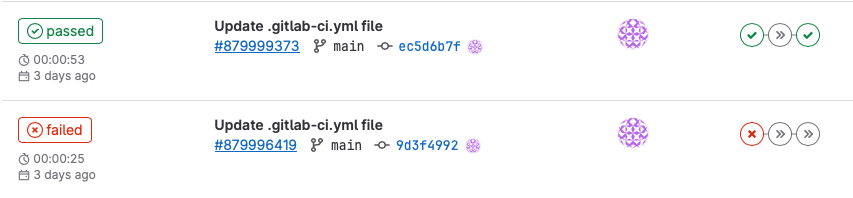
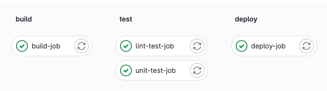
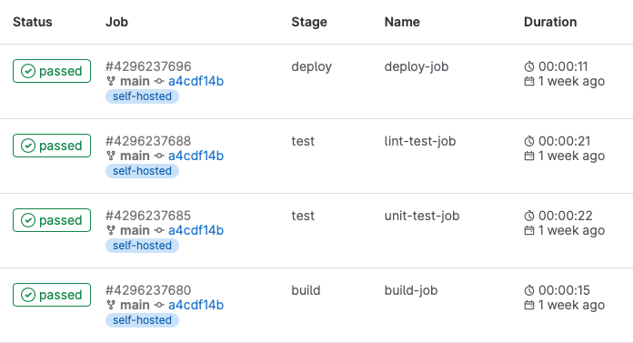

# 2. Architecture de base des pipelines Gitlab CICD

- [Projet](#21-projet)
- [Pipeline](#22-pipeline)
- [Stages](#23-stages)
- [Jobs](#24-jobs)
- [Runners](#25-runners)

---

# 2.1 Projet

Le projet Gitlab, avec un repo Git comme composant principal, est le coeur des pipelines de CICD.

Les pipelines sont définies et s'exécutent au sein d'un projet donné.

---

# 2.2 Pipeline

La pipeline est d'un enchainement de tâches, qui s'exécutent selon différentes conditions, dans un contexte donné, pour réaliser une action donnée.

Dans Gitlab, une pipeline est constituée d'étapes, ou *stages*, qui comprennent une ou plusieurs tâches, ou *jobs*.

---

# 2.3 Stages

Un regroupement logique de jobs qui vont s'exécuter en parallèle (sous réserve de suffisamment de puissance de calcul dispo).

Les stages s'exécutent les uns après les autres selon l'ordre défini dans le fichier de configuration.

---

# 2.4 Jobs

Les jobs sont les briques de base des pipelines. Chaque job est responsable de l'exécution d'une tache donnée.

Chaque job fait nécessairement partie d'un stage.

---

# 2.5 Runners

Les runners sont les agents où s'exécutent les étapes des pipelines.

Chaque runner a des caractéristiques qui lui sont propres (OS, architecture CPU, outils à disposition...).

Les runners peuvent être hébergés sur une infrastructure dédiée. Gitlab propose des runners sur son offre SaaS gitlab.com avec un pricing variant selon la souscription (Community vs Entreprise vs Premium) et le type de runner utilisé (Linux small, medium, large, macOS, GPU pour HPC...).