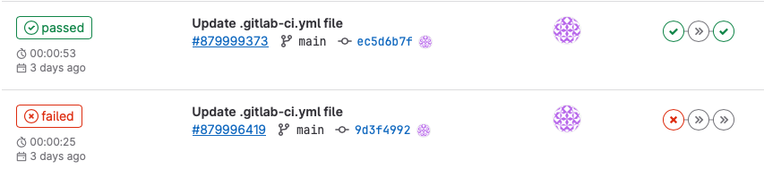
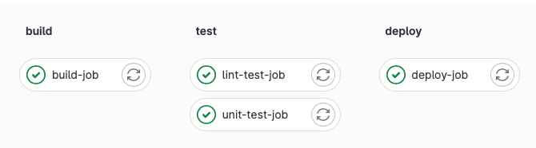
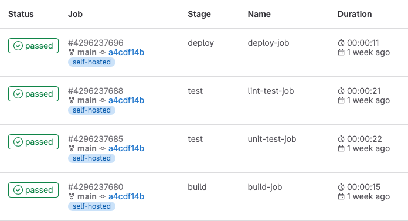

# **Gitlab CI** <!-- omit from toc -->

Bastien ANTOINE

---

# 1. Qu'est-ce qu'une chaine de CICD ?

- [Définition](#11-définition)
- [Les principes clés](#12-les-principes-clés)
- [Les outils à disposition](#13-les-outils-à-disposition)
- [Gitlab](#14-gitlab)

---

# 1.1 Définition

<div class="columns">
<div>

La CI/CD est une méthode **automatisée** de développement et de déploiement d'applications qui **vise à améliorer l'efficacité et la fiabilité du processus** en **intégrant régulièrement le code** et en **automatisant le déploiement** dans les différents environnements.

</div>
<div>


</div>

---

# 1.2 Les principes clés

1) Automatisation
2) Amélioration continue
3) Intégration continue
4) Déploiement continu
5) Gestion de version

---

# 1.3 Les outils à disposition

<div class="columns">
<div>

Un grand nombre d'outils permettent de mettre en place des chaines de CICD.

Certains proposent uniquement des fonctionnalités de CICD, tandis que d'autres intégrent les fonctionnalités de CICD au sein d'une plateforme de développement logiciel plus complète.

</div>
<div>

- Jenkins
- Circle CI
- Travis CI
- Azure Pipelines
- Github Actions
- Gitlab CICD
- ...

</div>

---

# 1.4 Gitlab

Gitlab est une plateforme de développement logiciel intégrant toutes les étapes de développement logiciel, depuis la conception et la planification, jusqu'à la livraison, en passant par le développement collaboratif du code et la gestion des incidents.

Gitlab est disponibles sous plusieurs offres et versions :
- Saas ([gitlab.com](https://gitlab.com)) vs self-hosted
- Community Edition vs Entreprise Edition vs Ultime Edition

[\[ref\]](https://about.gitlab.com/pricing/), [\[détails\]](https://about.gitlab.com/company/pricing/)

---

# 1.4 Gitlab

<div style="text-align: center; margin-top: 150px;">

## Room tour !

</div>

---

# 1.4.a Quelques précisions sur le contexte de la formation

Cette formation portera sur ce qu'il est possible de mettre en place au sein de l'offre **SaaS communautaire** ([gitlab.com](https://gitlab.com))

Les versions Entreprise et Ultimate apportent relativement peu de nouvelles fonctionnalités par rapport à ce qui est déjà proposé dans l'offre gratuite.

La version self-hosted est très proche de l'offre SaaS en terme de fonctionnalités disponibles.

---

# 1.4.a Quelques précisions sur le contexte de la formation

La documentation de Gitlab ([docs.gitlab.com](https://docs.gitlab.com)) indique la disponibilité des différentes fonctionnalités selon les version de Gitlab utilisées.

<div class="columns-3" style="margin-top: 30px;">
<div>


</div>
<div>


</div>
<div>


</div>

---

# 2. Architecture de base des pipelines Gitlab CICD

- [Projet](#21-projet)
- [Pipeline](#22-pipeline)
- [Stages](#23-stages)
- [Jobs](#24-jobs)
- [Runners](#25-runners)

---

# 2.1 Projet

Le projet Gitlab, avec un repo Git comme composant principal, est le coeur des pipelines de CICD.

Les pipelines sont définies et s'exécutent au sein d'un projet donné.

---

# 2.2 Pipeline

La pipeline est d'un enchainement de tâches, qui s'exécutent selon différentes conditions, dans un contexte donné, pour réaliser une action donnée.

Dans Gitlab, une pipeline est constituée d'étapes, ou *stages*, qui comprennent une ou plusieurs tâches, ou *jobs*.



---

# 2.3 Stages

Un regroupement logique de jobs qui vont s'exécuter en parallèle (sous réserve de suffisamment de puissance de calcul dispo).

Les stages s'exécutent les uns après les autres selon l'ordre défini dans le fichier de configuration.



---

# 2.4 Jobs

<div class="columns">
<div>

Les jobs sont les briques de base des pipelines. Chaque job est responsable de l'exécution d'une tache donnée.

Chaque job fait nécessairement partie d'un stage.
</div>
<div>



</div>
</div>

---

# 2.5 Runners

Les runners sont les agents où s'exécutent les étapes des pipelines.

Chaque runner a des caractéristiques qui lui sont propres (OS, architecture CPU, outils à disposition...).

Les runners peuvent être hébergés sur une infrastructure dédiée. Gitlab propose des runners sur son offre SaaS gitlab.com avec un pricing variant selon la souscription (Community vs Entreprise vs Premium) et le type de runner utilisé (Linux small, medium, large, macOS, GPU pour HPC...).

---

# 3. Contexte d'exécution des pipelines

- [Runners](#31-runners)
- [Variables](#32-variables)
- [Règles d'exécution conditionnelle](#33-règles-dexécution-conditionnelle)
- [Evénement déclenchant une pipeline](#34-evénement-déclenchant-une-pipeline)
- [Artefacts](#35-artefacts)

---

# 3.1. Runners

Chaque runner a des caractéristiques qui lui sont propres.

Les runners sont **identifiés et utilisés au moyen de tags**.

```yaml
my job:
  tags:
    - ruby
    - postgres
  script:
    - ...
```

---

# 3.1. Runners


---

# 3.1. Runners


---

# 3.1. Runners


---

# 3.1. Runners


---

# 3.1. Runners


---

# 3.1. Runners


---

# 3.1. Runners


---

# 3.1. Runners


---

# 3.1. Runners


---

## 3.1.a Runner scopes

<div class="columns">
<div>

**L'utilisation d'un runner par une pipeline dépend du scope du runner**, c.a.d là où il a été enregistré.

Plus un runner est enregistré haut dans l'arborescence des projets, plus il sera accessible à un grand nombre de projets.

[\[ref\]](https://docs.gitlab.com/ee/ci/runners/runners_scope.html)

</div>
<div>


</div>
</div>

---

## 3.1.b Runners executor

<div class="columns">
<div>

L'executor est le **programme charge d'exécuter les jobs sur le runner.**

Différents types d'executors sont supportés, chacun avec leurs caractéristiques.

[\[ref\]](https://docs.gitlab.com/runner/executors)

</div>
<div>

- Shell
- SSH
- Docker
- Virtual box
- Parrallels
- Kubernetes
- Custom

</div>
</div>

---

## 3.1.b Runners executor

Toutes les fonctionnalités ne sont pas supportées par tous les executors :
- SSH et Shell ne permettent qu'un nombre restreints de fonctionnalités
- Docker et Kubernetes sont les plus fournis

[\[ref\]](https://docs.gitlab.com/runner/executors/#compatibility-chart)

---

### Notes sur les executors Docker et Kubernetes

Les executors Docker et Kubernetes lancent les jobs qui leur sont associés dans des conteneurs. Il est donc **nécessaire de définir l'image à utiliser pour le job** :
1. Au sein du job

```yaml
python job:
  image: python:3.11
  script: python --version
```

2. Au sein du runner avec une image par défaut

---

# Exercice

Prerequis :

- Il est nécessaire de configurer un access token ou une clé SSH pour permettre le push git

- [Exercice 1](https://gitlab.com/bastien-antoine/orness/formation-gitlab/exercises/-/tree/ex1)

- [Exercice 2](https://gitlab.com/bastien-antoine/orness/formation-gitlab/exercises/-/tree/ex2)

---

# 3.2. Variables

Gitlab CI propose un méchanisme de variables permettant d'accéder à différentes informations liées au projet dans lequel la pipeline s'exécute, de contrôler son exécution ainsi qu'éviter des répétitions.

---

## 3.2.a Définitions des variables

Les variables de CICD peuvent être définies à différents endroits :
- Pour toute une pipeline, avec le keyword `global:variables`
	- les variables définies ainsi sont accessibles dans tous les jobs de la pipeline
- Pour un job en particulier, avec le keyword `[job]:variables`

---

## 3.2.a Définitions des variables

```yaml
variables:
  GLOBAL_VAR: "A global variable"

job1:
  variables:
    JOB_VAR: "A job variable"
  script:
    - echo "Variables are '$GLOBAL_VAR' and '$JOB_VAR'"

job2:
  script:
    - echo "Variables are '$GLOBAL_VAR' and '$JOB_VAR'"
```

---

## 3.2.a Définitions des variables

<div class="columns">
<div>

Il est également possible de définir des varibles CICD au niveau d'un projet, d'un groupe voire même d'une instance Gitlab.

En cas de définition multiple d'une variable à plusieurs niveaux, la valeur utilisée est celle de la source la plus proche.

</div>
<div>


</div>
</div>

---

## 3.2.b Précédence des variables

1. Trigger via l'API pipeline, l'API REST, pour les pipelines programmées ou lancées manuellement
2. Variables de projet
3. Variables de groupes
4. Variables d'instance
5. Variables définies dans les jobs du `.gitlab-ci.yml`
6. Variables définies au niveau global dans le `.gitlab-ci.yml`
7. Variables liées au déploiement
8. Variables prédéfinies

[\[ref\]](https://docs.gitlab.com/ee/ci/variables/index.html#cicd-variable-precedence)

---

## 3.2.c Variables prédéfinies

* `CI_COMMIT_*`: infos sur le commit sur lequel pointe la pipeline
* `CI_JOB_*`: infos sur le job en cours d'exécution
* `CI_PIPELINE_*`: infos sur la pipeline en cours
* `CI_PROJECT_*`: infos sur le project où la pipeline s'execute
* `CI_MERGE_REQUEST_*`: infos sur la merge request liée à la pipeline
* Et plein d'autres...

[\[ref\]](https://docs.gitlab.com/ee/ci/variables/predefined_variables.html)

---

## 3.2.d Où et comment utiliser les variables

```yaml
variables:
  BASE_PYTHON_IMAGE: python

stages:
  - tests

test python 3.10:
  stage: tests
  variables:
    PYTHON_VERSION: '3.10'
  image: ${BASE_PYTHON_IMAGE}:${PYTHON_VERSION}
  script:
    - echo "Running tests for python ${PYTHON_VERSION}"
```

[\[ref\]](https://docs.gitlab.com/ee/ci/variables/where_variables_can_be_used.html)

---

### Notes sur la syntaxe des variables

Le remplacement des variables CICD utlisées dans un pipeline par leur valeur est fait à différents moments, selon l'endroit de leur utilisation : instance Gitlab, runner ou shell d'exécution. La syntaxe autorisée pour les variables diffère selon l'outil effectuant le remplacement :
- Instance Gitlab : `$variable`, `${variable}` ou `%variable%`
- Runner : `$variable` ou `${variable}`
- Shell d'éxecution : selon le shell utilisé

[\[ref\]](https://docs.gitlab.com/ee/ci/variables/where_variables_can_be_used.html#expansion-mechanisms)

---

## 3.2.e Sécurisation des variables de CICD

Les variables de CICD définies au sein du fichier de config `.gitlab-ci.yml` ne doivent pas être utilisées pour contenir des données sensibles, puisque le fichier de config est accessible librement.

Les variables définies au niveau d'un projet, d'un groupe ou d'une instance peuvent être marquées comme sensibles, et ainsi être protégées de la modification ainsi que leur affichage dans les logs.

---

## 3.2.e Sécurisation des variables de CICD

> ℹ️ **Note** : La valeur des variables à masquer doit respecter quelques contraintes pour pouvoir être correctement masquée dans les logs.

> ⚠️ **Attention** : Ce mécanisme est du *best-effort*, préférer les variables de type `file` pour limiter les risques, voire même l'utilisation d'outils dédiés à la gestion des secrets.

[\[ref\]](https://docs.gitlab.com/ee/ci/variables/#mask-a-cicd-variable)

---

# 3.3. Règles d'exécution conditionnelle

Comme le fichier `.gitlab-ci.yml` est le seul fichier de configuration des pipelines de CICD, il est nécesaire de pouvoir controler à quel moment et sous quelles conditions les jobs sont ajoutés aux pipelines, afin de pouvoir créer des workflows plus complexes.

Il est ainsi possible de définir des règles indiquant dans quel cas ajouter les jobs à la pipeline, à l'aide des keyword `rules`ou `only`/`except`

---

# 3.3. Règles d'exécution conditionnelle

> ⚠️ **Attention** : Les règles d'ajout d'un job à une pipelines sont évaluées lors de la création de la pipeline. Ainsi il n'est pas possible d'utiliser des variables dont la valeur est définie lors de l'exécution de la pipeline.
>
> Seules les variables prédéfinies, ou celles définies dans le fichier de config, au niveau du projet, d'un groupe parent ou de l'instance peuvent être utilisées.

---

# 3.3. Règles d'exécution conditionnelle

Plusieurs contrôles sont possibles :
- `rules:if`: contrôle sur une [expression booléenne](https://docs.gitlab.com/ee/ci/jobs/job_control.html#cicd-variable-expressions) [\[ref\]](https://docs.gitlab.com/ee/ci/yaml/index.html#rulesif)
- `rules:changes`: contrôles sur un/des fichier(s) changé(s) dans la branche/le commit en question via un ou plusieurs patterns [\[ref\]](https://docs.gitlab.com/ee/ci/yaml/index.html#ruleschanges)
- `rules:exists`: contrôles sur un/des fichier(s) existant(s) dans la branche/le commit en question via un ou plusieurs patterns [\[ref\]](https://docs.gitlab.com/ee/ci/yaml/index.html#rulesexists)

---

# 3.3. Règles d'exécution conditionnelle

Si plusieurs conditions sont fournies dans une même règles, **elles doivent toutes matcher** pour que le job soit ajouté dans la pipeline (ie. un *AND* est appliqué entre toutes les conditions).

Si plusieurs règles sont indiquées, **elles sont évaluées de haut en bas**. La première qui match est utilisée. Si aucun règle ne match, le job n'est pas ajouté.

[\[ref\]](https://docs.gitlab.com/ee/ci/jobs/job_control.html#specify-when-jobs-run-with-rules)

---

## 3.3.a Paramètres des jobs

Les jobs ont différents paramètres qui contrôlent différents aspects de leur comportement :
- `[job]:variables`: permet de définir ou redéfinir une ou plusieurs variables accessibles au sein du job en question [\[ref\]](https://docs.gitlab.com/ee/ci/yaml/#variables)
- `[job]:when`: indique sous quelles conditions lancer le job [\[ref\]](https://docs.gitlab.com/ee/ci/yaml/#when)
- `[job]:allow_failure`: indique si le job est autoriser à échouer ou non [\[ref\]](https://docs.gitlab.com/ee/ci/yaml/#allow_failure)

---

## 3.3.a Paramètres des jobs

Certains paramètres d'un job peuvent être définis ou mis à jour selon différentes conditions :
- `rules:when`: indique sous quelle condition lancer un job [\[ref\]](https://docs.gitlab.com/ee/ci/yaml/index.html#when)
- `rules:variables`: une liste de variables définies ou mises à jour pour le job [\[ref\]](https://docs.gitlab.com/ee/ci/yaml/index.html#rulesvariables)
- `rules:allow_failure`: indique si le job est autorisé à échouer ou non [\[ref\]](https://docs.gitlab.com/ee/ci/yaml/index.html#rulesallow_failure)

---

### À propos du keyword `when`

* `on_success`: exécute le job uniquement lorsque tous les jobs précédents sont considérés en succès
* `on_failure` : exécute le job uniquement lorsque au moins un des jobs précédents échoue
* `manual`: lance le job manuellement
* `never` : ne pas ajouter le job dans la pipeline (ne peut être utilisé que dans les rules)
* `always` : exécuter le job quel que soit le statut des jobs précédents
* `delayed`: retarde l’exécution d’un job pendant une durée spécifiée

---

## 3.3.b Exemples

Construire une nouvelle version d'une image Docker que si le Dockerfile a changé ou bien qu'il y ait une nouvelle version :
```yaml
docker build:
  stage: build
  rules:
    - changes:
        - Dockerfile
      variables:
        VERSION: dev
    - if: $CI_COMMIT_TAG
      variables:
        VERSION: $CI_COMMIT_TAG
  script: docker build -t my-image:$VERSION .
```

---

## 3.3.b Exemples

Déployer sur un environment particulier que dans le cas d'un commit sur une branche donnée :
```yaml
deploy:
  stage: deploy
  rules:
    - if: $CI_COMMIT_BRANCH == "rct"
      variables:
        ENVIRONMENT: "RCT"
  script:
    - echo "Deploy to $ENVIRONMENT"
    - ...
```

---

## 3.3.c Lancer des jobs manuellement

Un job est considéré manuel lorsqu'il est ajouté avec l'attribut `when: manual`. Il y a deux types de jobs manuels :
1. jobs bloquants : `allow_failure: false`
	- Pipeline en status *bloqué* tant que le job n'a pas été lancé manuellement.
2. jobs optionnels: `allow_failure: true`
   - Les jobs suivants sont lancés, le job courant n'est pas lancé tant qu'une action manuelle n'a pas été faite.

---

## 3.3.c Lancer des jobs manuellement

Le comportement par défaut est le suivant :
- Si le job a `when: manual` défini au niveau du job, par défaut `allow_failure: true`
- Si le job a `when: manual` défini au niveau d'une rule, par défaut `allow_failure: false`

---

## 3.3.d Contrôler l'éxecution des pipelines
Il est possible de définir des règles contrôlant dans quel cas les pipelines sont créées, à l'aide du keyword `workflow:rules`.

Les contrôles possibles sont les mêmes que pour les jobs.

```yaml
workflow:
  rules:
  - if: $CI_COMMIT_TITLE =~ /-draft$/
    when: never
  - if: $CI_PIPELINE_SOURCE == "merge_request_event"
  - if: $CI_COMMIT_BRANCH == $CI_DEFAULT_BRANCH
```

[\[ref\]](https://docs.gitlab.com/ee/ci/yaml/workflow.html)

---

# 3.4. Evénement déclenchant une pipeline
Une pipeline est toujours associée à un évenement qui l'a déclenchée. 12 différents types d'évenements existent, les plus courants :

- `push`: Pour les pipelines associées à un évenement `git push`
- `merge_request_event`: Pour les pipelines associées à une MR.
- `api`, `trigger`: Pour les pipelines créées via l'API de pipelines ou bien à l'aide d'un trigger token.

[\[ref\]](https://docs.gitlab.com/ee/ci/jobs/job_control.html#common-if-clauses-for-rules)

---

# 3.5. Artefacts
Les artefacts sont des fichiers/dossiers générés par des jobs. Ils sont envoyés à l'instance Gitlab une fois l'exécution du job terminé.

Ils peuvent être utilisé pour transmettre des résultats intermédiaires d'un job à un autre au sein d'une pipeline, ou bien mis à disposition des utilisateurs au sein de l'interface Gitlab.

```yaml
pdf:
  script: xelatex mycv.tex
  artifacts:
    paths:
      - mycv.pdf
```

---

## 3.5.a Configuration des artefacts
* `artifacts:paths` et `artifacts:exclude`: une liste de chemins ou glob pattern pour identifier les fichiers ou dossiers à, respectivement, inclure ou exclure de la collecte des artefacts [\[ref\]](https://docs.gitlab.com/ee/ci/yaml/index.html#artifactspaths)
* `artifacts:expire_in`: permet d'indiquer la période de conservation des artefacts collectés. Par défaut à 30 jours [\[ref\]](https://docs.gitlab.com/ee/ci/yaml/index.html#artifactsexpire_in)
* `artifacts:when`: indique dans quel cas collecter les artefacts, selon le statut du job [\[ref\]](https://docs.gitlab.com/ee/ci/yaml/index.html#artifactswhen)

---

## 3.5.b Partage d'artefacts entre jobs

<div class="columns">
<div>

Par défaut, un job va récupérer tous les artefacts des jobs précédents terminés en succès.

Il est possible de choisir les artefacts à récupérer dans un job avec `[job].dependencies`.

[\[ref\]](https://docs.gitlab.com/ee/ci/jobs/job_artifacts.html)

</div>
<div>

```yaml
stages:
  - build
  - test
  - upload

build macos:
  stage: build
  artifacts: ...

build linux:
  stage: build
  artifacts: ...

test macos:
  stage: test
  artifacts: ...
  dependencies:
    - build macos

test linux:
  stage: test
  artifacts: ...
  dependencies:
    - build linux

upload:
  stage: upload
```

</div>
</div>

---

## 3.5.b Partage d'artefacts entre jobs


---

## 3.5.b Partage d'artefacts entre jobs


---

## 3.5.b Partage d'artefacts entre jobs


---

## 3.5.b Partage d'artefacts entre jobs


---

## 3.5.b Partage d'artefacts entre jobs


---

## 3.5.c Rapports extrait d'artefacts
Certains type d'artefacts générés par différents outils peuvent être marqués comme étant des rapports au format bien identifiés, et ainsi être utilisés pour apporter plus d'informations à différents endroits de Gitlab (page de merge requests, section *"Sécurité"*...).

De nombreux types de rapports sont disponibles, mais la plus part pour les versions premium et ultimate.

[\[ref\]](https://docs.gitlab.com/ee/ci/yaml/artifacts_reports.html)

---

### Rapports de tests

<div class="columns">
<div>

Le rapport doit être au format JUnit, supportés par de nombreux framework de tests de différents langages.

Dans le cas des pipelines de merge request, le résultat du rapport est affiché au sein de la merge request.

[\[ref\]](https://docs.gitlab.com/ee/ci/testing/unit_test_reports.html)

</div>
<div>

```yaml
my job:
  artifacts:
    reports:
      junit: report.xml
```


</div>
</div>

---

### Rapports de tests
```yaml
golang:
  stage: test
  script:
    - go install gotest.tools/gotestsum@latest
    - gotestsum --junitfile report.xml --format testname
  artifacts:
    reports:
      junit: report.xml

python:
  stage: test
  script:
    - pytest --junitxml=report.xml
  artifacts:
    reports:
      junit: report.xml
```

---

### Rapport de couverture

<div class="columns">
<div>

Le rapport doit être au format Cobertura, supporté par de nombreux framework de tests de différents langages.

Dans le cas des pipelines de merge request, le résultat du rapport est affiché au sein de la merge request.

[\[ref\]](https://docs.gitlab.com/ee/ci/testing/test_coverage_visualization.html)

</div>
<div>

```yaml
artifacts:
  reports:
    coverage_report:
      coverage_format: cobertura
      path: coverage/cobertura-coverage.xml
```


</div>
</div>

---

### Rapport de couverture
```yaml
golang:
  stage: test
  script:
    - go install
    - go test ./... -coverprofile=coverage.txt -covermode count
    - go get github.com/boumenot/gocover-cobertura
    - go run github.com/boumenot/gocover-cobertura < coverage.txt > coverage.xml
  artifacts:
    reports:
      coverage_report:
        coverage_format: cobertura
        path: coverage.xml

python:
  stage: test
  script:
    - pip install pytest pytest-cov
    - pytest --cov --cov-report term --cov-report xml:coverage.xml
  artifacts:
    reports:
      coverage_report:
        coverage_format: cobertura
        path: coverage.xml
```

---

<div style="text-align: center; margin-top: 220px;">

## Des questions ?

</div>

---

## Exercices

- [Exercice 3](https://gitlab.com/bastien-antoine/orness/formation-gitlab/exercises/-/tree/ex3)

- [Exercice 4](https://gitlab.com/bastien-antoine/orness/formation-gitlab/exercises/-/tree/ex4)

- [Exercice 5](https://gitlab.com/bastien-antoine/orness/formation-gitlab/exercises/-/tree/ex5)

- [Exercice 6](https://gitlab.com/bastien-antoine/orness/formation-gitlab/exercises/-/tree/ex6)

- [Exercice 7](https://gitlab.com/bastien-antoine/orness/formation-gitlab/exercises/-/tree/ex7)


---

<div style="text-align: center; margin-top: 220px;">

## Merci !

</div>

---

